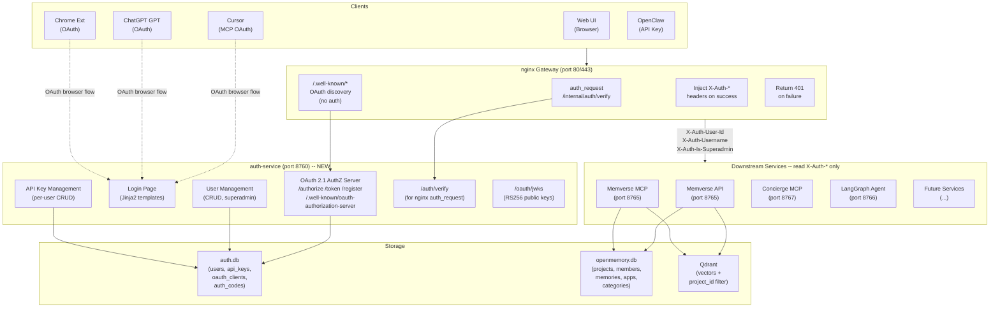
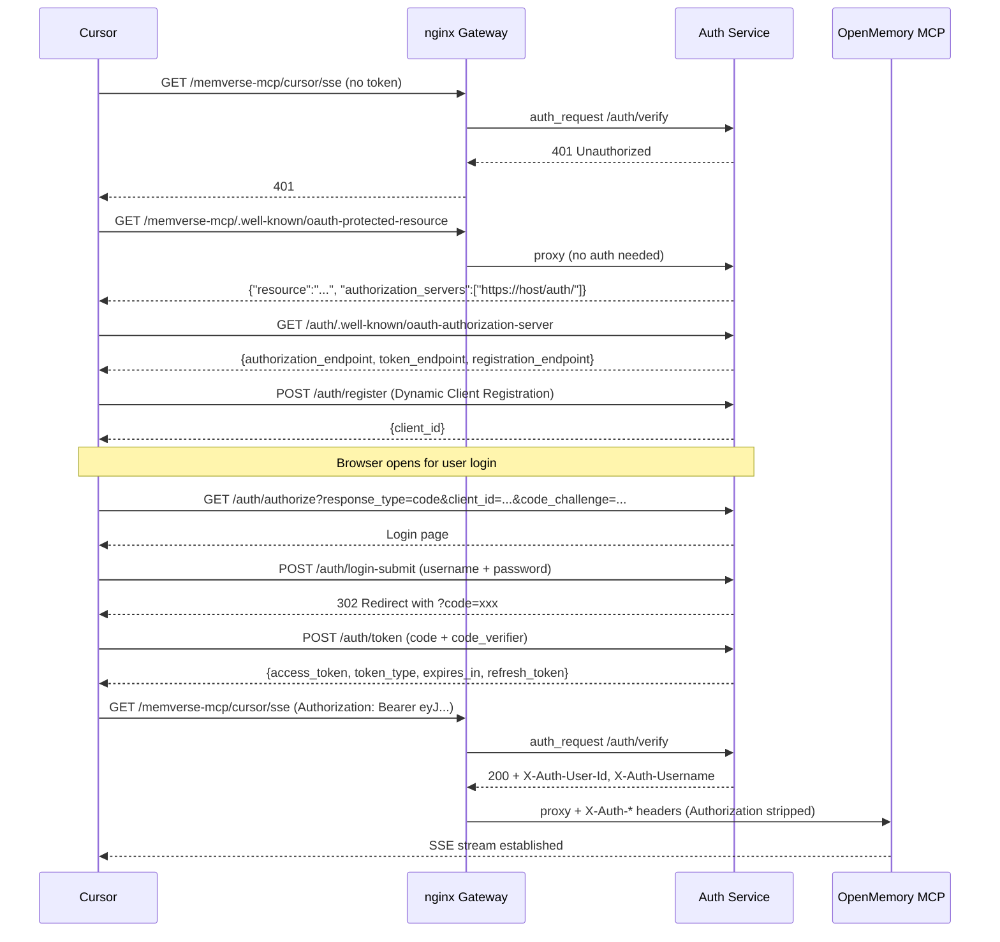

# Memverse 多用户 + 认证网关 + 项目隔离方案

## 核心理念：认证与业务分离

构建独立的 **Auth Service** 作为 OAuth 2.1 Authorization Server，**nginx** 升级为认证网关。所有下游服务（OpenMemory、Concierge、LangGraph 等）不再处理任何认证逻辑，只从网关注入的 HTTP headers 读取已认证用户信息，专注各自的业务和鉴权。

## 目标架构




---

## 各客户端认证流程

### Cursor MCP -- OAuth 2.1 浏览器授权（类似 Atlassian MCP）




用户体验：Cursor 中输入 MCP URL -> 点 Connect -> 浏览器弹出登录页 -> 登录 -> 回到 Cursor 连接成功。**与 Atlassian MCP 完全一致。**

### ChatGPT Actions -- OAuth Authorization Code

ChatGPT 原生支持 OAuth 2.0 配置：

- Authorization URL: `https://arthaszeng.top/auth/authorize`
- Token URL: `https://arthaszeng.top/auth/token`
- Client ID / Secret: 预注册的 `chatgpt` confidential client
- 所有 URL 共享根域名 `arthaszeng.top`（满足 ChatGPT 同域名要求）

用户首次使用 GPT -> ChatGPT 引导 OAuth -> 登录页登录 -> 授权 -> ChatGPT 获得 token -> 后续请求带 `Authorization: Bearer <jwt>`。

### Chrome Extension -- OAuth + Popup

1. Extension 打开新标签页到 `https://arthaszeng.top/auth/authorize?client_id=chrome-ext&redirect_uri=...`
2. 用户在 Auth Service 登录页登录
3. 授权后重定向回 extension callback
4. Extension 用 code 换 token，存入 `chrome.storage`
5. 后续 API 调用带 `Authorization: Bearer <jwt>`

### Web UI -- 直接登录（第一方应用优化）

1. OpenMemory UI 显示自己的登录表单
2. POST `https://arthaszeng.top/auth/login` -> 返回 JWT
3. 存入 `om_token` cookie（SameSite=Strict，非 httpOnly，因为 axios 需读取跨域发送）
4. axios interceptor 自动附加 `Authorization: Bearer <jwt>`
5. 所有 API 调用通过 nginx gateway -> auth_request 验证 -> 注入 headers -> 到达后端

### OpenClaw / 编程客户端 -- API Key

1. 用户在 UI 生成 `om_xxxx...`
2. 配置到客户端
3. 请求带 `Authorization: Bearer om_xxxx...`
4. nginx auth_request -> Auth Service 识别为 API Key -> 返回用户信息

---

## 完整移除清单

以下旧机制将被**彻底删除**：

- `API_KEY` 环境变量 + `X-API-Key` 自定义 header + `ApiKeyMiddleware` 类
- `AUTH_USERNAME` / `AUTH_PASSWORD` / `AUTH_SECRET` 环境变量
- UI 的 HMAC session token 系统（[openmemory/ui/lib/auth.ts](openmemory/ui/lib/auth.ts)）
- `MEMVERSE_USER` / `USER_ID` 环境变量
- `create_default_user()` / `create_default_app()` 启动逻辑
- [nginx/nginx.conf](nginx/nginx.conf) line 82 硬编码的 `proxy_set_header X-API-Key`
- Memverse API/MCP 中所有认证相关代码

---

## Phase 1: Auth Service + nginx Gateway

### 1.1 新建 Auth Service

新建 `openmemory/auth/` 目录，独立 FastAPI 应用（port 8760）。

**数据库 (auth.db) 表设计：**

- `users`: id(UUID), username(unique), email, password_hash(bcrypt), is_superadmin, must_change_password, is_active, created_at, updated_at
- `api_keys`: id(UUID), user_id(FK), key_hash(bcrypt), key_prefix(11 chars, "om_" + 8), name, created_at, last_used_at, is_active
- `oauth_clients`: id(UUID), client_id(unique), client_secret_hash(nullable), redirect_uris(JSON), grant_types(JSON), client_name, is_dynamic(bool), created_at
- `authorization_codes`: id(UUID), code_hash, client_id, user_id(FK), redirect_uri, code_challenge, code_challenge_method, scopes, expires_at, used(bool)
- `refresh_tokens`: id(UUID), token_hash, user_id(FK), client_id, scopes, expires_at, revoked(bool)

**JWT 签名: RS256（非 HS256）**

- Auth Service 启动时生成或加载 RSA keypair（私钥文件持久化到 volume）
- 私钥签发 token，公钥通过 JWKS 端点暴露
- 任何服务都可以用公钥验证 JWT，无需共享密钥
- 符合 MCP 规范要求和 OAuth 2.1 最佳实践

**OAuth 2.1 端点：**

- `GET /auth/.well-known/oauth-authorization-server` -- 元数据发现
- `POST /auth/register` -- Dynamic Client Registration (MCP 规范要求)
- `GET /auth/authorize` -- 授权端点（展示登录页或 consent 页）
- `POST /auth/token` -- Token 端点（code -> access_token + refresh_token）
- `GET /auth/jwks` -- JWKS 公钥
- `POST /auth/token/revoke` -- Token 撤销

**直接登录端点（第一方应用）：**

- `POST /auth/login` -- 用户名密码 -> JWT（Web UI 使用）
- `POST /auth/change-password` -- 修改密码
- `GET /auth/me` -- 当前用户信息

**Token 验证端点（nginx auth_request 专用）：**

- `GET /auth/verify` -- 从 `Authorization` header 提取 token，验证后通过 response headers 返回用户信息

```python
@app.get("/auth/verify")
async def verify_token(request: Request, db: Session = Depends(get_db)):
    """Called by nginx auth_request subrequest."""
    token = extract_bearer_token(request)
    if not token:
        raise HTTPException(401)

    if is_jwt(token):       # starts with "eyJ"
        user = verify_jwt_rs256(token)  # verify signature with private key
    elif is_api_key(token):  # starts with "om_"
        user = verify_api_key(token, db)
    else:
        raise HTTPException(401)

    if not user or not user.is_active:
        raise HTTPException(401)

    return Response(status_code=200, headers={
        "X-Auth-User-Id": str(user.id),
        "X-Auth-Username": user.username,
        "X-Auth-Is-Superadmin": str(user.is_superadmin).lower(),
    })
```

**Protected Resource Metadata 端点：**

- `GET /auth/resource-metadata/{service_name}` -- 返回指定资源服务的 OAuth 元数据

```json
{
  "resource": "https://arthaszeng.top/memory-mcp/",
  "authorization_servers": ["https://arthaszeng.top/auth/"],
  "bearer_methods_supported": ["header"],
  "scopes_supported": ["mcp.read", "mcp.write"]
}
```

**用户管理端点（需 superadmin）：**

- `POST /auth/users` -- 创建用户（邀请制，设临时密码，must_change_password=True）
- `GET /auth/users` -- 用户列表
- `PUT /auth/users/{id}` -- 更新
- `DELETE /auth/users/{id}` -- 停用
- `POST /auth/users/{id}/reset-password` -- 重置密码

**API Key 管理端点（需已认证用户）：**

- `POST /auth/api-keys` -- 生成 key（返回明文仅此一次）
- `GET /auth/api-keys` -- 列表（只显示前缀 + 名称 + 最后使用时间）
- `DELETE /auth/api-keys/{id}` -- 吊销

**登录页面（Jinja2 模板，用于 OAuth browser flow）：**

- 简洁的登录表单 + TailwindCSS CDN
- 登录成功后继续 OAuth authorize 流程（回调跳转）
- 不需要 React，纯 HTML 即可

**预注册 OAuth Clients：**

- `chatgpt` -- confidential client（有 client_secret），redirect_uri 为 ChatGPT 回调
- `chrome-ext` -- public client，redirect_uri 为 extension callback
- MCP 客户端（Cursor 等）通过 Dynamic Client Registration 自动注册

**依赖：**

- `fastapi`, `uvicorn`, `sqlalchemy` (SQLite)
- `PyJWT` + `cryptography` (RS256 JWT)
- `bcrypt` (密码 + API Key 哈希)
- `jinja2` (登录页模板)

### 1.2 nginx Gateway 改造

修改 [nginx/nginx.conf](nginx/nginx.conf)，在 HTTP 和 HTTPS server 块中：

```nginx
# ===== Auth Service routes -- NO auth required =====
location /auth/ {
    proxy_pass http://127.0.0.1:8760;
    proxy_set_header Host $host;
    proxy_set_header X-Forwarded-Proto $scheme;
}

# ===== OAuth Protected Resource Metadata -- NO auth required =====
# MCP clients fetch /{service}/.well-known/oauth-protected-resource
location ~ ^/(memverse-mcp|concierge-mcp)/\.well-known/oauth-protected-resource$ {
    proxy_pass http://127.0.0.1:8760;
    rewrite ^/(.*)/\.well-known/oauth-protected-resource$
            /auth/resource-metadata/$1 break;
}

# ===== Internal auth verification subrequest =====
location = /internal/auth/verify {
    internal;
    proxy_pass http://127.0.0.1:8760/auth/verify;
    proxy_pass_request_body off;
    proxy_set_header Content-Length "";
    proxy_set_header X-Original-URI $request_uri;
    proxy_set_header Authorization $http_authorization;
}

# ===== Protected: Memverse API =====
location /api/ {
    auth_request /internal/auth/verify;
    auth_request_set $auth_user_id $upstream_http_x_auth_user_id;
    auth_request_set $auth_username $upstream_http_x_auth_username;
    auth_request_set $auth_is_superadmin $upstream_http_x_auth_is_superadmin;

    proxy_set_header X-Auth-User-Id $auth_user_id;
    proxy_set_header X-Auth-Username $auth_username;
    proxy_set_header X-Auth-Is-Superadmin $auth_is_superadmin;
    proxy_set_header Authorization "";   # strip token from downstream

    limit_req zone=api_limit burst=20 nodelay;
    proxy_pass http://127.0.0.1:8765;
    # ... existing proxy headers ...
}

# ===== Protected: Memverse MCP SSE =====
location /memverse-mcp/ {
    auth_request /internal/auth/verify;
    auth_request_set $auth_user_id $upstream_http_x_auth_user_id;
    auth_request_set $auth_username $upstream_http_x_auth_username;
    auth_request_set $auth_is_superadmin $upstream_http_x_auth_is_superadmin;

    proxy_set_header X-Auth-User-Id $auth_user_id;
    proxy_set_header X-Auth-Username $auth_username;
    proxy_set_header X-Auth-Is-Superadmin $auth_is_superadmin;
    proxy_set_header Authorization "";

    # SSE-specific (existing)
    proxy_http_version 1.1;
    proxy_set_header Connection "";
    proxy_buffering off;
    proxy_cache off;
    proxy_read_timeout 86400s;
    proxy_send_timeout 86400s;

    proxy_pass http://127.0.0.1:8765;
}

# ===== Protected: Concierge MCP SSE (same pattern) =====
# ... same auth_request pattern for /concierge-mcp/ ...
```

**关键：** `.well-known` 和 `/auth/` 路由在 protected 路由之前声明，确保 OAuth 发现端点不需要认证。

### 1.3 docker-compose 新增 auth-service

```yaml
auth-service:
  build: auth/
  environment:
    - INIT_ADMIN_USER=${INIT_ADMIN_USER:-arthaszeng}
    - INIT_ADMIN_PASSWORD=${INIT_ADMIN_PASSWORD}
    - AUTH_BASE_URL=${AUTH_BASE_URL:-https://arthaszeng.top/auth}
  ports: ["8760:8760"]
  volumes: [auth_data:/data]
  command: uvicorn main:app --host 0.0.0.0 --port 8760
```

---

## Phase 2: 下游服务改造 + 项目隔离

### 2.1 Memverse API/MCP 认证简化

修改 [memverse/api/main.py](memverse/api/main.py) 和所有 routers：

**删除：**

- `ApiKeyMiddleware` 及所有 `API_KEY` / `MEM0_USER` 引用
- `create_default_user()` / `create_default_app()`

**新建 `app/utils/gateway_auth.py`：**

```python
from fastapi import Request, HTTPException

def get_current_user(request: Request) -> dict:
    """Read user info from nginx gateway-injected headers.
    This is the ONLY auth code downstream services need."""
    user_id = request.headers.get("X-Auth-User-Id")
    if not user_id:
        raise HTTPException(401, "Not authenticated via gateway")
    return {
        "user_id": user_id,
        "username": request.headers.get("X-Auth-Username", ""),
        "is_superadmin": request.headers.get("X-Auth-Is-Superadmin") == "true",
    }
```

所有需要认证的端点改为 `user = Depends(get_current_user)` -- 只读 3 个 header，零认证逻辑。

### 2.2 MCP OAuth 适配

修改 [memverse/api/app/mcp_server.py](memverse/api/app/mcp_server.py)：

- **删除** URL 路径中的 `/{user_id}`
- SSE URL 变为：`/memverse-mcp/{client_name}/sse?project={slug}`
- 用户身份完全来自 nginx 注入的 `X-Auth-`* headers（OAuth 已在 gateway 完成）
- MCP handler 从 request headers 读取用户信息，设入 ContextVar

### 2.3 新增 Project 模型 + Router

在 Memverse DB ([memverse/api/app/models.py](memverse/api/app/models.py)) 新增：

**projects 表：** id(UUID), name, slug(unique), owner_id, description, created_at, updated_at

**project_members 表：** id(UUID), project_id(FK), user_id(FK), role(Enum: admin/normal/read), created_at; UniqueConstraint(project_id, user_id)

**memories 表扩展：** 新增 project_id(FK, nullable for migration)

新建 `memverse/api/app/routers/projects.py`：

- CRUD + 成员管理
- 鉴权：`get_current_user()` 拿到 user_id，查 `project_members` 判断角色

### 2.4 Memory 端点改造

修改 [memverse/api/app/routers/memories.py](memverse/api/app/routers/memories.py)：

- 所有端点加 `project_slug` 参数
- 权限校验：read 角色只能 search/list/get，normal 角色 CRUD，admin 角色 CRUD + 项目管理
- mem0 SDK 用 `project_id` 做 Qdrant filter（传入 user_id 参数位）
- SQLite 记录真实 user_id + project_id
- Qdrant payload 新增 `project_id`

---

## Phase 3: UI + 外部客户端

### 3.1 Memverse UI 认证重构

**删除：**

- [memverse/ui/lib/auth.ts](memverse/ui/lib/auth.ts) 中的 HMAC session 系统
- [memverse/ui/app/api/auth/login/route.ts](memverse/ui/app/api/auth/login/route.ts) 中的环境变量校验

**新 Login 流程：**

1. Login 页 POST `/auth/login`（经 nginx 到 auth-service）
2. 返回 `{access_token, user, must_change_password}`
3. JWT 存 `om_token` cookie（SameSite=Strict，非 httpOnly）
4. 若 must_change_password，跳转改密码页

**Axios interceptor（[memverse/ui/lib/api.ts](memverse/ui/lib/api.ts)）：**

```typescript
api.interceptors.request.use((config) => {
  const token = getCookie("om_token");
  if (token) config.headers.Authorization = `Bearer ${token}`;
  return config;
});
```

**Next.js middleware（[memverse/ui/middleware.ts](memverse/ui/middleware.ts)）：** 读 `om_token` cookie，解码 JWT 检查 exp，过期则重定向 `/login`。

**新增页面：**

- `/admin/users` -- 用户管理（superadmin，调 auth-service API）
- `/settings/api-keys` -- API Key 管理（调 auth-service API）
- `/projects` -- 项目管理
- `/change-password` -- 修改密码
- Navbar 项目切换 dropdown

### 3.2 ChatGPT Actions 适配

修改 [gpt/chatgpt-action-schema.json](gpt/chatgpt-action-schema.json)：

```json
"securityDefinitions": {
  "oAuth2": {
    "type": "oauth2",
    "flow": "authorizationCode",
    "authorizationUrl": "https://arthaszeng.top/auth/authorize",
    "tokenUrl": "https://arthaszeng.top/auth/token"
  }
}
```

预注册 `chatgpt` OAuth client（confidential，带 client_secret）。

### 3.3 Chrome Extension 适配

Extension 使用 OAuth Authorization Code + PKCE，打开标签页到 `/auth/authorize`。

### 3.4 OpenClaw 适配

API Key 方式：`Authorization: Bearer om_xxx`。

---

## Phase 4: 数据迁移

新建 `memverse/auth/scripts/migrate.py` 和 `memverse/api/scripts/migrate_projects.py`：

1. 在 auth.db 创建 `arthaszeng` 为 superadmin（临时密码）
2. 在 openmemory.db 创建 "arthaszeng" 默认项目
3. 迁移所有现有 memories 到该项目
4. 更新 Qdrant payload 加 `project_id`
5. 预注册 OAuth clients（chatgpt, chrome-ext）

---

## 环境变量变更

**删除：**

- `API_KEY`, `AUTH_USERNAME`, `AUTH_PASSWORD`, `AUTH_SECRET`, `MEMVERSE_USER`

**新增 (auth-service)：**

- `INIT_ADMIN_USER` / `INIT_ADMIN_PASSWORD` -- 首次启动创建 admin（之后忽略）
- `AUTH_BASE_URL` -- Auth Service 对外 URL（OAuth metadata 中使用）

**保留 (memverse)：**

- `OPENAI_API_KEY`, `OPENAI_BASE_URL` 等 LLM/Embedding 配置不变

## 依赖

**auth-service (新)：** fastapi, uvicorn, sqlalchemy, PyJWT, cryptography (RS256), bcrypt, jinja2

**memverse-api (移除 auth 依赖)：** 不再需要认证相关库

---

## 为什么这个架构是好的

**认证与业务完全分离：**

- Auth Service 只管认证（who are you），Memverse 只管记忆业务，nginx 只管路由和认证委派
- 新增服务只需在 nginx 加一个 `location` 块 + `auth_request`，零代码修改
- JWT 和 API Key 对 gateway 来说是统一接口（Bearer token），下游服务不感知 token 类型
- 下游服务只依赖 3 个 header（`X-Auth-User-Id`, `X-Auth-Username`, `X-Auth-Is-Superadmin`），不依赖 auth 实现
- 符合 MCP 2025-11-25 规范（OAuth 2.1 + PKCE + Protected Resource Metadata + Dynamic Client Registration）

**统一的用户体验：**

- Cursor MCP：与 Atlassian 一样的浏览器授权流程
- ChatGPT：原生 OAuth 集成
- Chrome Extension：标准 OAuth popup
- Web UI：直接登录（第一方应用优化）
- 编程客户端：API Key

全部通过同一个 Auth Service、同一套用户数据库、同一个 nginx Gateway。

**参考实现：** [mcp-oauth-example](https://github.com/mbroton/mcp-oauth-example) -- FastAPI OAuth 2.1 Authorization Server + FastMCP Resource Server 的最小化参考。

---

## ChatGPT Custom GPT 公开发布安全评估

改造完成后，Custom GPT **可以安全地公开发布**。原因如下：

**当前问题（不安全）：**
- 目前使用全局共享的 `X-API-Key`，如果 GPT 发布出去，任何用户都共享同一个 key，能看到你的所有记忆
- API Key 硬编码在 GPT 配置中，泄露后无法区分是谁在用

**改造后（安全）：**
- ChatGPT Actions 配置为 OAuth Authorization Code 流程
- 每个用户首次使用 GPT 时，需要在你的 Auth Service 登录页完成 OAuth 授权
- 只有在 Auth Service 中有账号的用户才能通过 OAuth 获得 token
- 每个用户的 token 只能访问该用户有权限的项目和记忆
- token 有过期时间，即使泄露影响也有限
- 可以随时在 Auth Service 中撤销用户或吊销 token

**发布后的访问控制模型：**
- 公开发布 GPT -> 任何人可以看到并尝试使用
- 使用时 ChatGPT 触发 OAuth -> 跳转到你的登录页
- 没有账号的人无法通过登录 -> 无法使用 GPT 的 Actions
- 有账号的人登录后 -> 只能访问自己被授权的项目
- superadmin 通过邀请制控制谁能注册 -> 完全可控

**结论：** OAuth 是 ChatGPT Actions 的推荐认证方式，比 API Key 安全得多。发布后等于给 GPT 加了一道"登录门"，没有账号的人进不去。

---

## 回滚策略

### 核心原则：只做增量，不做破坏性变更

整个改造过程中，**不会修改或删除任何现有数据**。所有变更都是增量的。

### Qdrant 保护

- Qdrant collection `openmemory` **不做任何结构性修改**
- Phase 2 的数据迁移只是在现有 payload 上**追加** `project_id` 字段
- 原有的 `user_id`, `data`, `hash`, `created_at` 等字段完全保留
- 即使回滚到旧代码，旧代码按 `user_id` 查询仍然正常工作（多了个 `project_id` 字段不影响）
- 迁移脚本在执行前**先备份** Qdrant snapshot：`POST /collections/openmemory/snapshots`

### SQLite 保护

- **auth.db 是新建的独立数据库**，不触碰 openmemory.db 的现有表
- openmemory.db 只做增量变更：
  - 新增 `projects`, `project_members` 表（全新，回滚时可 DROP）
  - `memories` 表新增 `project_id` 列（nullable，不影响现有数据）
  - 不修改、不删除任何现有列或数据
- 迁移前**备份** openmemory.db：`cp openmemory.db openmemory.db.bak.$(date +%s)`

### nginx 保护

- 旧 nginx.conf 备份为 `nginx.conf.before-auth`
- 新配置中 `/auth/` 和 `auth_request` 是新增的 location 块
- 如果 auth-service 挂了，auth_request 返回 502 → 所有请求被拒 → 可以快速回滚 nginx 配置恢复旧行为

### Docker 保护

- 改造前 `docker commit` 当前所有运行容器的镜像快照
- 新增的 auth-service 是独立容器，停止/删除不影响其他服务
- docker-compose.yml 修改前备份

### 回滚操作步骤（如果需要）

```bash
# 1. 停止 auth-service
docker stop auth-service

# 2. 恢复 nginx 旧配置
cp nginx.conf.before-auth nginx.conf
nginx -s reload

# 3. 恢复 openmemory.db（如果做了迁移）
cp openmemory.db.bak.* openmemory.db

# 4. 重启 OpenMemory（旧代码在 main 分支）
git checkout main
docker-compose up -d memverse-mcp

# 5. Qdrant 不需要恢复（增量字段不影响旧查询）
# 如果确实需要恢复：POST /collections/openmemory/snapshots/{name}/restore
```

**总结：最坏情况下，5 分钟内可以完全回滚到改造前的状态。**

---

## 开发工作流

### 分支策略

```
main (当前稳定版本，云服务器运行中)
  └── feat/multi-user-auth (所有改造在此分支)
       ├── Phase 1 commits: auth-service + nginx gateway
       ├── Phase 2 commits: downstream simplify + project model
       ├── Phase 3 commits: UI + external clients
       └── Phase 4 commits: migration scripts
```

### 开发流程

**Step 0: 验证现状**
- 确认 main 分支代码与云服务器一致
- 本地 `docker-compose up` 验证所有服务正常运行
- 跑一遍基本功能回归（MCP 连接、记忆 CRUD、UI 登录、ChatGPT API）

**Step 1: 拉分支**
- `git checkout -b feat/multi-user-auth`
- 所有改动在此分支进行

**Step 2: 本地开发（全部 Phase）**
- 本地 docker-compose 包含 auth-service + nginx + openmemory + qdrant
- 每个 Phase 完成后在本地做完整功能验证
- 不触碰云服务器

**Step 3: 本地验证 checklist**

Phase 1 验证：
- [ ] auth-service 启动正常，admin 用户创建成功
- [ ] `/auth/login` 返回 JWT
- [ ] `/auth/verify` 正确验证 JWT 和 API Key
- [ ] OAuth flow 可以在浏览器中完成（用 MCP Inspector 测试）
- [ ] nginx auth_request 正确注入 headers

Phase 2 验证：
- [ ] OpenMemory API 可以读取 X-Auth-* headers
- [ ] 项目 CRUD 正常
- [ ] 记忆写入带 project_id
- [ ] Qdrant 查询按 project_id 过滤正确

Phase 3 验证：
- [ ] UI 登录流程正常
- [ ] 项目切换正常
- [ ] Cursor MCP OAuth flow 端到端成功

Phase 4 验证：
- [ ] 迁移脚本在备份数据上跑通
- [ ] 迁移后旧数据可以正常查询
- [ ] 回滚脚本验证通过

**Step 4: 部署到云服务器**
- 先在云上做完整备份（Qdrant snapshot + SQLite copy + docker commit + nginx.conf backup）
- 部署 auth-service（新容器，不影响旧服务）
- 切换 nginx 配置
- 执行数据迁移
- 验证
- 如有问题，执行回滚

### 云上操作的原则

- 非必要不操作云服务器
- 所有代码变更在本地完成
- 云上只做：备份 → 部署 → 验证 → （回滚）
- 部署时保持旧服务运行，新服务并行启动后再切换